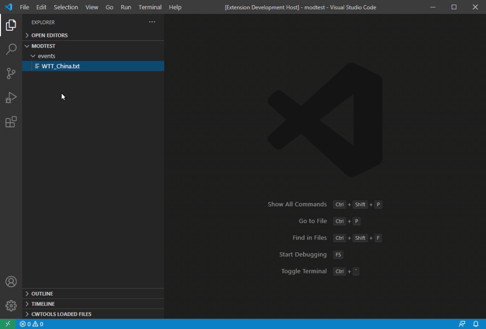
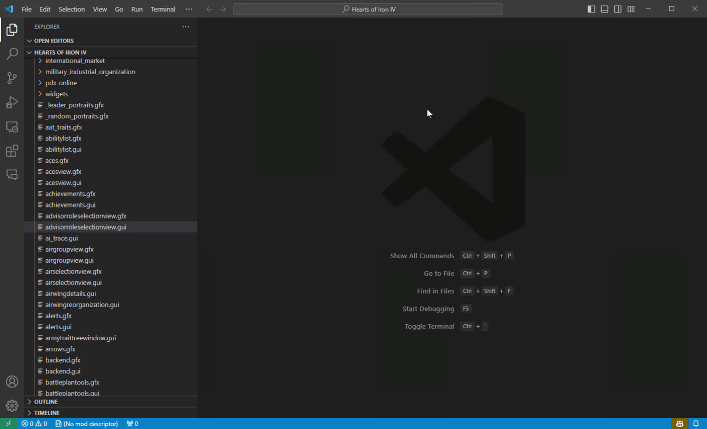

# HOI4 Mod Utilities

This extension add tools for Heart of Iron IV modding. Some of the tools may work on other Paradox games.

**[Support me on Patreon](https://www.patreon.com/chaofan)**

## Features

* World map preview
* Focus tree preview
* Event tree preview
* Technology tree preview
* Military industrial organization (MIO) preview.
* GUI preview
* `.gfx` file preview (sprites used by HOI4 are defined here)
* `.dds`, `.tga` file preview (images files used by HOI4)

For feature details and user manual, please refer to [HOI4 Mod Utilities Wiki](https://github.com/herbix/hoi4modutilities/wiki).

## Steps to start

1. Install and enable this extension in VSCode.
2. Set Heart of Iron IV install path. You can:
    * (Since v0.7.0, or on [vscode web](https://vscode.dev)) Open command palette using `Ctrl+Shift+P`. Use command `Select HOI4 install path` to browse the folder that installed Heart of Iron IV.
    * Update setting `hoi4ModUtilities.installPath` (you can open settings page of VSCode using `Ctrl+,`) to the folder that installed Heart of Iron IV.
3. Open your mod develop folder.
4. (*Optional*) Open command palette using `Ctrl+Shift+P`. Use command `Select mod file` to set working mod descriptor (the `.mod` file).
5. Use these entries:
    * Command palette (`Ctrl+Shift+P`) commands: `Preview World Map` and `Preview HOI4 file`*.
    * `Preview HOI4 file` ()* button on right-top tool bar of text editor.
    * Open a `.dds` or `.tga` file.

\* *`Preview HOI4 file` () button/command is invisible, except on `.gfx`, `map/default.map`, technology tree or national focus tree files.*

## Demos

### World map preview

### Focus tree preview

### Event tree preview

### Technology tree preview

### GUI Preview

## Extension Settings

|Setting|Type|Description|
|-------|----------|--------|
|`hoi4ModUtilities.installPath`|`string`|Hearts of Iron IV install path. Without this, most features are broken.|
|`hoi4ModUtilities.loadDlcContents`|`boolean`|Whether to load DLC images when previewing files. Enabling this will use more memory (All DLCs are around 600MB).|
|`hoi4ModUtilities.modFile`|`string`|Path to the working `.mod` file. This file is used to read replace_path. If not specified, will use first `.mod` file in first folder of the workspace.|
|`hoi4ModUtilities.enableSupplyArea`|`boolean`|If you are developing mod for HOI4(version<=1.10). Use this to check enable supply area.|
|`hoi4ModUtilities.previewLocalisation`|`enum`|Language of content in event tree preview.|
|`hoi4ModUtilities.featureFlags`|`array` of `string`|Feature flags are used to disable or enable features. Reloading is required after changing this. Please refer to [Wiki](https://github.com/herbix/hoi4modutilities/wiki/Feature-flags) on Github for details.|

## Known Issues

* GUI of focus tree can't be configured like technology tree.
* Edge lines on world map not alway fit edge of colors.
* Event tree preview will duplicate events even they are same event if they are from different option.

## Release Notes - [0.11.2]

### Added
* Updated Korean translation (Contributor: [gyhs(NIKA)](https://github.com/gyhs)).

### Fixed
* Fix a bug that some conditions are treated as scope.

## Contribute
* If you have any suggestion, feel free to create issue on this [Github repo](https://github.com/herbix/hoi4modutilities).
* If you want to contribute translation, feel free to create pull request to this [Github repo](https://github.com/herbix/hoi4modutilities). All localization related files are under `i18n` folder.

* Thanks to all contributors listed [here](https://github.com/herbix/hoi4modutilities/graphs/contributors).

## Support
* If you feel this extension useful and want to support me, please visit [my Patreon page](https://www.patreon.com/chaofan). Your issues will get resolved faster if you are my Patrons.