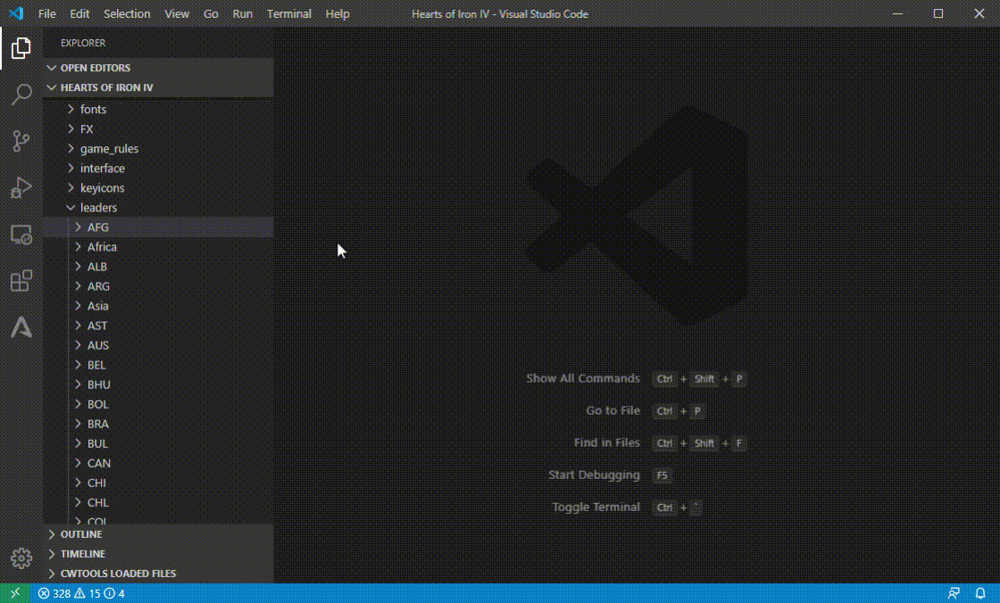

# HOI4 Mod Utilities

This extension add tools for Heart of Iron IV modding. Some of the tools may work on other Paradox games.

**Please set extension setting `hoi4ModUtilities.installPath` to correct HOI4 install path (and reload VSCode if possible) before using any preview features below. Or they won't be properly rendered.**

## Features

### Focus tree preview

* Render focus tree as graph.
* Navigate to `focus` tag in document by clicking a focus in graph.
* Show/hide focus branches (available for focuses has `allow_branch` tag).
* Auto update preview when document updates.
* Preview focus tree file that contains `shared_focus` tree.
* Can be dragged to scroll.

### Technology tree preview

* Render technology tree as GUI defined in `interface\countrytechtreeview.gui` (icons, texts defined in this file will also be rendered).
* Navigate to related technology tag by clicking technology or subtechnology.
* Auto update preview when technology file changed.
* Switch technology folder if a technology tree contains technology from different folder.
* Can be dragged to scroll.

### GFX file preview

* Preview all `spritetype` and `corneredTileSpriteType` tags in `.gfx` files.
* Filter sprites by name.
* Navigate to related tag in document by clicking a sprite in list.
* Show image size and path on tooltip.

### DDS preview

* Preview `.dds` file (partially support).

## Extension Settings

|Setting|Type|Description|
|-------|----------|--------|
|`hoi4ModUtilities.installPath`|`string`|Hearts of Iron IV install path. Without this all icons will be invisible.|
|`hoi4ModUtilities.loadDlcContents`|`boolean`|Whether to load DLC images when previewing files. Enabling this will use more memory (All DLCs are around 600MB).|
|`hoi4ModUtilities.modFile`|`string`|Path to the working .mod file. This file is used to read replace_path. If not specified, will use first .mod file in first folder of the workspace.|

## Known Issues

* DDS preview supports RGB or RGBA format only. Most of DDS files in Heart of Iron IV are in this format. DDS files in other format can't be previewed yet.
* Focus tree preview uses sprites from `interface/goals.gfx`. If you defined custom sprite and use it in focus, it will be shown as unknown focus icon.

## Release Notes

### 0.2.0

### Added
* Technology tree preview
  * Render technology tree as GUI defined in `interface\countrytechtreeview.gui` (icons, texts defined in this file will also be rendered).
  * Navigate to related technology tag by clicking technology or subtechnology.
  * Auto update preview when technology file changed.
  * Switch technology folder if a technology tree contains technology from different folder.
  * Can be dragged to scroll.
* GFX file preview
  * Support `corneredTileSpriteType` tags.

### Changed
* GFX file preview
  * Show image size on tooltip.
* Focus tree preview
  * Can be dragged to scroll.

### Fixed
* Fix 1 pixel offset of read `.dds` file.
