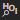
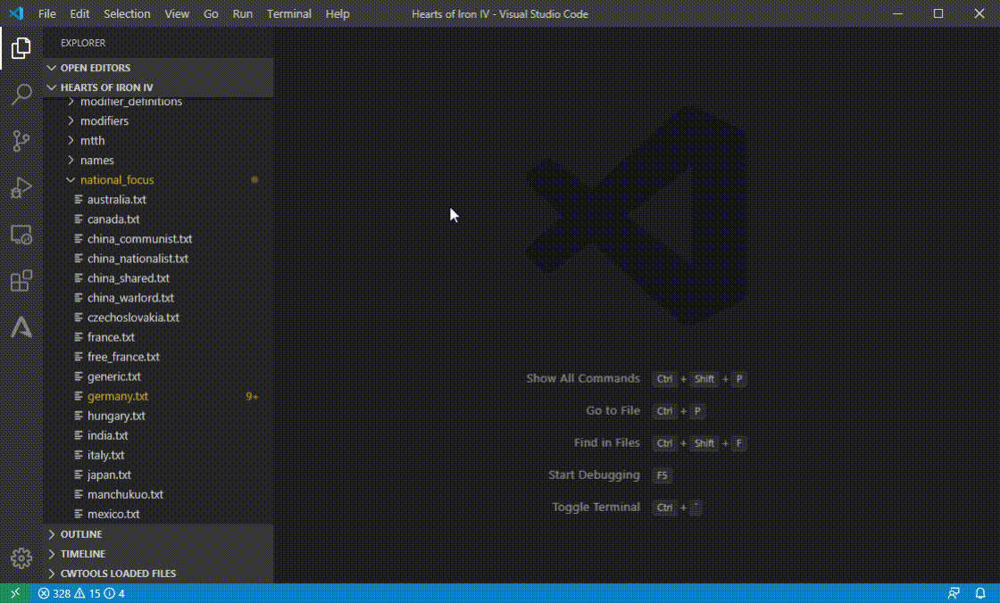
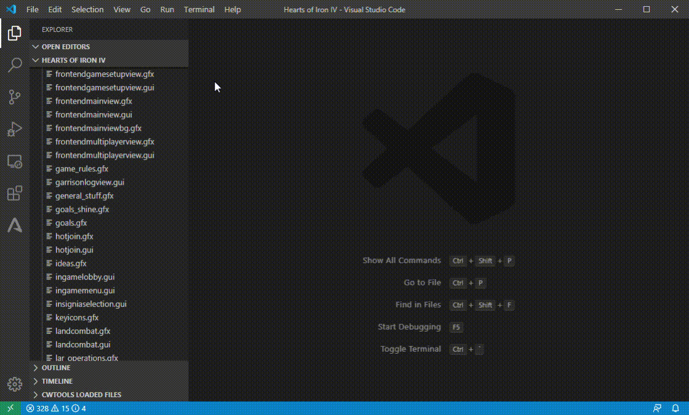

# HOI4 Mod Utilities

This extension add tools for Heart of Iron IV modding. Some of the tools may work on other Paradox games.

## Features

* World map preview
* Focus tree preview
* Technology tree preview
* `.gfx` file preview (sprites used by HOI4 are defined here)
* `.dds` file preview (images files used by HOI4)

For feature details and user manual, please refer to [HOI4 Mod Utilities Wiki](https://github.com/herbix/hoi4modutilities/wiki).

## Steps to start

1. Install and enable this extension in VSCode.
2. Update setting `hoi4ModUtilities.installPath` to the folder that installed Heart of Iron IV.
3. Open your mod develop folder.
4. (*Optional*) Open command palette using `Ctrl+P`. Use command `Select mod file` to set working mod descriptor (the `.mod` file).
5. Use these entries:
    * Command palttle (`Ctrl+P`) commands: `Preview World Map` and `Preview HOI4 file`*.
    * `Preview HOI4 file` ()* button on right-top tool bar of text editor.
    * Open a `.dds` file.

\* *`Preview HOI4 file` () button/command is invisible, except on `.gfx`, technology tree or national focus tree files.*

## Demos

### World map preview

### Focus tree preview

### Technology tree preview

### GFX file preview

## Extension Settings

|Setting|Type|Description|
|-------|----------|--------|
|`hoi4ModUtilities.installPath`|`string`|Hearts of Iron IV install path. Without this all icons will be invisible.|
|`hoi4ModUtilities.loadDlcContents`|`boolean`|Whether to load DLC images when previewing files. Enabling this will use more memory (All DLCs are around 600MB).|
|`hoi4ModUtilities.modFile`|`string`|Path to the working .mod file. This file is used to read replace_path. If not specified, will use first .mod file in first folder of the workspace.|

## Known Issues

* GUI of focus tree can't be configured like technology tree.
* Edge lines on world map not alway fit edge of colors.

## Release Notes

### 0.3.2

### Changed
* Align style of checkbox and combobox with VSCode.
* Click item in GFX file preview will navigate to name of sprite instead of type.

### Fixed
* Performance issue when opening world map preview.
